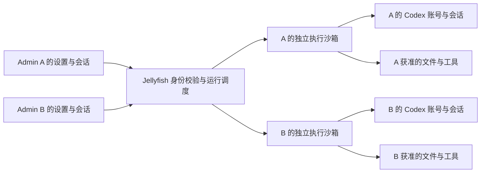

# Codex 按管理员接入：账号、执行范围与并发

> 历史设计 / 阶段验收记录：文中的分支、角色与未实现项以记录当时为准。当前 v1.3.0 使用 [标准模式](runtime-standard-mode.md) 和 [主机超管控制台](superadmin-console.md)；早期验证结果不代表当前完整生产验收。

日期：2026-09-15。状态：用户已确认产品目标；本文是下一阶段设计，未实现多管理员运行或严格隔离。

> 后续范围已调整为「标准模式由超管连接并授权可信 admin 共享使用；Docker 隔离模式由各 admin 连接自己的 Codex / Cursor」。角色、权限、设置页与实施顺序以 [可选隔离扩展设计](runtime-deployment-design.md) 为准；本文保留作前期多租户讨论背景。

## 1. 已确认的目标

- 同一台 Jellyfish 服务器承载多个互不可信的 admin。
- 每个 admin 在现有设置里的模型配置区域连接自己的 Codex 账号、选择默认模型。
- 每个 admin 使用自己所连接账号的订阅额度；不同 admin 能同时执行。
- Codex 的文件、工具、会话、审批和产物权限不能超出该 admin 获准的范围。
- 当前宿主机单管理员试验台继续用于本地验证；不能通过删除 admin 白名单直接开放给多租户。

admin 是 Jellyfish 租户身份，不是宿主机管理员权限。Codex/OpenAI 账号是另一个身份。两个 Jellyfish admin 若连接同一 OpenAI 账号，不能据此获得两份独立额度。

## 2. 设置页的用户流程

保留 `/settings/general`，在现有 API Key 与模型区域增加「Agent 引擎」配置：

1. 选择 DeepAgents 或 Codex。
2. 选择 Codex 后点击「连接我的 Codex」。展示官方验证地址和一次性设备码。
3. admin 在官方页面登录并授权；Jellyfish 展示等待、成功、过期、取消或失败。
4. 成功后显示该账号的脱敏标识、可用模型、订阅类型及配额（只有供应商返回时才显示）。
5. 选择模型及其支持的推理强度，保存为新会话默认值。已有会话保持原绑定。
6. 提供重新连接和断开连接。余额不足、限流或认证失效只影响该 admin；不自动改用平台 Key 或其他 admin 的账号。

Codex 是执行引擎，模型是引擎下的配置；现有 `anthropic:...` 等 LangChain 模型 ID 不直接传给 Codex。模型、推理强度与原生生图都从当前连接的能力中选择。

鉴权采用官方 App Server 的 `account/login/start` + `chatgptDeviceCode`，消费 `account/login/completed`，并用 `account/read` 复核结果。本机固定版本导出的 schema 已包含设备码字段，但尚未在远端多账号环境实测。设备码登录可能需要账号或工作区启用；不可用时明确提示，不把服务端 localhost 回调直接交给远端浏览器。[App Server 鉴权协议](https://learn.chatgpt.com/docs/app-server)、[设备码登录说明](https://learn.chatgpt.com/docs/auth)

这验证的是技术接入路径；公开托管个人订阅执行的支持范围仍需确认。官方认证文档对程序化 CLI 工作流建议 API Key，并提示不要在不可信或公共环境直接暴露 Codex 执行，不能把一次本机 OAuth 成功当作该部署模式已获支持。

## 3. 运行与权限模型

### 3.1 控制层

- `admin_id` 只从 Jellyfish 已认证身份取得，不信任客户端提交的 owner、profile 路径或模型自报身份。
- 所有会话、运行、审批、事件订阅、登录任务和下载均校验 owner。知道 UUID 不代表获得访问权。
- Web API 不直接执行用户 shell；由受控调度器分派到该 admin 的沙箱。浏览器不能访问原始 App Server RPC 或容器管理 API。
- 运行环境只接收已授权的文档和工具。后续 MCP 凭据绑定 admin、会话、允许动作和到期时间，不携带平台管理员 token。

### 3.2 执行层

首版以 admin 为沙箱单位，同一 admin 内默认一次运行，不同 admin 独立并发。每轮再限制到所选工作区；若将来服务访客拥有更小权限，必须建立独立执行范围，不能复用整个 admin 的可读环境。

生产目标使用 Linux 上的 microVM 或经过兼容性验证的 gVisor 沙箱。优先验证能否在目标服务器运行 microVM；普通 Docker、独立 cwd、文件夹权限和 Codex workspace-write 不作为严格隔离已完成的证据。microVM 依赖宿主虚拟化能力；gVisor 有系统调用兼容性与性能取舍，需实际运行所固定的 Linux Codex 版本。[Firecracker](https://firecracker-microvm.github.io/)、[gVisor 架构](https://gvisor.dev/docs/)

每个沙箱独立配置：

- 私有 HOME、CODEX_HOME、进程空间、临时目录、持久卷和运行记录；不跨 admin 复用带状态的实例。
- 不挂载服务器根目录、整份 `users/`、共享开发者 HOME、Docker socket、平台配置或云凭据。
- 文件输入由 StorageService 按 owner 物化；输出只能经校验与归档进入产品存储。禁止把 CLI 返回的路径当作宿主机任意文件路径。
- 限制 CPU、内存、进程数、磁盘、运行时长和输出量，避免一个 admin 耗尽整个服务器。
- 网络隔离由宿主侧执行：阻断其他租户、宿主控制端口、云元数据与内网；按需开放官方认证、推理和图片所需出口。对 DNS、IPv6、重定向和代理绕过进行验证。
- 禁止通过审批扩大到宿主或别的 admin。执行命令的进程必须始终位于隔离边界内。

认证持久卷不进入 Jellyfish 通用文件浏览、文档同步、ZIP 备份或产物归档。凭据按租户加密保存，恢复给对应沙箱；平台密钥不进入沙箱。独立 CODEX_HOME 能分开账号状态，但不能保证同一个沙箱内的原生命令读不到本 admin 的登录缓存；首版信任边界是 admin，不能把它复用于权限更低的消费者。

**旁路也需要验收**：现有 `/api/scripts/run`、用户包安装、DeepAgents 原生执行和后台任务都应在同一安全边界内运行，或在严格模式下禁用。仅把 Codex 放进容器，不能证明整个 Jellyfish 已具备互不可信多租户隔离。文件、备份导入和 symlink 处理也需覆盖。

## 4. 账号生命周期与并发

拟存储 `RuntimeProfile(admin_id, runtime, credential_ref, auth_generation, status, model, sandbox_ref)`。登录任务绑定 `(admin_id, login_id, auth_generation, expires_at)`；profile 不存原始 token。

- 同一 admin 同时只能有一个有效登录尝试，发起新尝试使旧尝试失效。旧通知不能覆盖新身份。
- 回调完成后通过对应沙箱中的 `account/read` 确认身份；前端提交「登录成功」不生效。
- 切换账号时先停止接收新任务、取消并确认旧任务退出，再更新身份代次。旧会话禁止用新账号静默恢复。
- 断开连接终止相关运行与后台刷新，执行 `account/logout` 并移除平台保管的对应凭据。历史产物保留，不把本地 logout 描述为撤销所有设备的 OpenAI 会话。
- 每个 profile 只由一个执行 worker 持有租约；多个 Web worker 通过队列分派，不在每个进程各建一个全局字典来规避锁。
- 全局容量不足时公平排队；A 等待审批、限流或断线不能阻塞 B。admin 内初始并发数为 1，是可配置的产品限制，不是 Codex 的固有限制。
- 空闲可回收沙箱，身份卷保持；恢复前检查 owner、身份代次和旧实例是否已退出。共享暖池只能使用不含凭据和租户数据的干净实例。

## 5. 响应速度：已观察到的开销与测量

当前代码中，每轮 `_execute` 新建 Codex 进程，结束后关闭；`emit()` 每个事件同步执行 JSONL fsync 和元数据文件 fsync；SSE 每 300ms 重新读取运行日志。这些是可确认的实现开销，尚无计时数据证明哪一项是用户所感知延迟的主要原因。

下一阶段分别记录排队、沙箱准备、协议初始化、会话恢复、提交、首个模型 delta、首个浏览器可见文本及总耗时，区分首 token 延迟和持续输出速度。

优化候选：

1. 每个 admin 的活跃沙箱内保温 App Server，按会话路由事件；轮次完成仍须清理原生工具子进程、确认工作区静止后归档。
2. 将文本增量短批次持久化，文件 I/O 放到独立写入器；提交成功后再按顺序发布。审批与终态立即持久化，保持可重放与幂等。
3. SSE 由新事件通知唤醒，重连按游标补读，不重复全量扫描日志。
4. 提供该模型支持的推理强度设置。用同模型、同提示、同网络比较冷启动和热启动，再判断是否需要换模型。

不预先承诺某个秒数或吞吐倍数；沙箱加强后也要纳入性能实测。

## 6. 实施顺序与退出条件

1. **安全运行底座**：确认服务器隔离技术，建立两 admin 的假凭据与标记文件，运行越权/资源限制用例；失败时拒绝启动，禁止回落宿主机执行。
2. **租户 profile 与自助鉴权**：落到 `/settings/general`；独立登录、取消、过期、刷新、登出和身份代次测试。
3. **并发运行与模型设置**：替换 `_pilot` 单例/全局 admin 环境变量；每 admin worker、队列、租约、会话归属和停止/恢复闭环。
4. **产品与性能验收**：真实账号 A/B 同时执行、文档产物归档、原生生图、断线恢复和时延对比。

必须验证：A 猜 B 的 session/run/login/artifact ID；路径穿越和链接；A 命令读取 B 凭据或宿主文件；访问内网/元数据；A 无限派生进程或填满磁盘；A 登出/换号而 B 继续；旧登录结果晚到；服务重启导致重复执行；现有脚本/包安装旁路。

当前本机已登录 profile 不自动复制给新 admin。现有 `shinan` 绑定与单管理员试验服务保持原样，迁移时由用户明确认领或重新登录。
