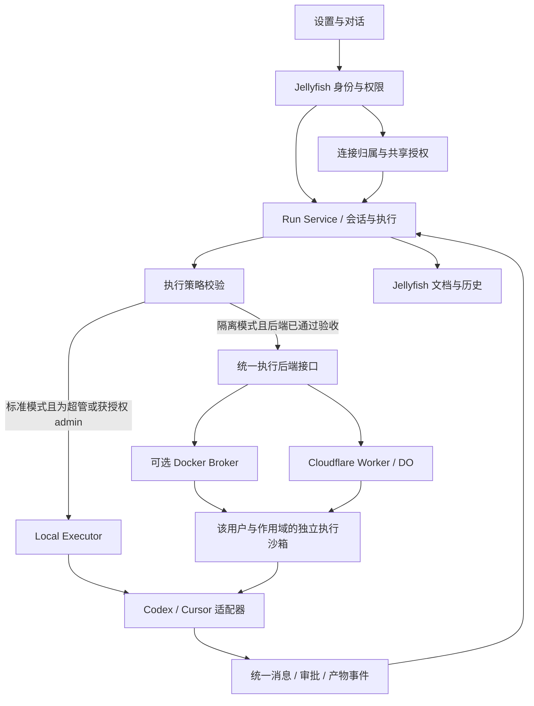

# OpenJellyfish：可选隔离扩展设计

> 历史设计 / 阶段验收记录：文中的分支、角色与未实现项以记录当时为准。当前 v1.3.0 使用 [标准模式](runtime-standard-mode.md) 和 [主机超管控制台](superadmin-console.md)；早期验证结果不代表当前完整生产验收。

2026-09-16 · 设计评审稿，尚未实施。标准模式支持超管向可信 admin 授权共享连接，隔离模式支持各 admin 自带账号；权限策略与 Docker / Cloudflare 等执行后端分开。开发拆解见 [PR 计划](runtime-implementation-pr-plan.md)。

## 1. 定义与决定

OpenJellyfish / Jellyfish / jellyfishbot 在本讨论中是同一项目。

- **超管（owner）**：服务器或个人主机的主人，部署应用、分发 admin 账号，管理部署能力与资源。
- **admin**：独立用户，管理自己的文档、服务和模型；按部署模式使用超管授权的连接，或管理自己的引擎账号，不拥有宿主机管理权限。
- **消费者（consumer）**：使用 admin 发布服务的人；权限小于 admin，不管理引擎账号。

一个应用、一套 Runtime 接口，两种权限策略：

| 策略 | 产品名称与前提 | 账号连接与使用 | 执行位置 |
| --- | --- | --- | --- |
| `trusted_shared`（默认） | 标准模式 · 可信团队 | 超管连接自己的 Codex，可授权指定 admin 使用；admin 不自助登录。Cursor 接入后沿用同一授权模型 | 首版本机执行后端 |
| `tenant_isolated`（可选） | 隔离模式 · 各 admin 可互不可信 | 超管与各 admin 分别连接和使用自己的 Codex / Cursor CLI | 经验证满足隔离要求的执行后端 |

部署配置拆为 `access_mode` 与 `execution_backend=local|docker|cloudflare`。Docker 是可选的自托管后端，Cloudflare 是待验证的托管后端；ECS / EKS 后续按需求增加。旧草案中的 `owner_local` / `tenant_sandbox` 尚未实施，按此命名更新。不是所有组合都可用：`tenant_isolated + local` 拒绝，未通过隔离验收的后端不能开放给不可信 admin；后端故障不降级成 local。

标准模式中，超管可只给自己用，也可按账号逐个授权；新增 admin 默认没有共享连接权限。共享的是供应商账号及其额度，会话、工作目录、审批和产物仍按任务发起者管理。这是应用层的逻辑分开，不是恶意用户之间的安全隔离。隔离模式首版仅提供个人连接，不开放跨租户共享连接。

**主应用以 Docker Compose 启动不等于用户隔离。** 当前 Compose 的应用容器挂载整份用户数据，仍属于标准模式。必须显式启用隔离扩展、通过环境检查，才开放用户连接。

## 2. 权限设计

| 操作 | 标准·超管 | 标准·admin | 隔离·超管 | 隔离·admin |
| --- | --- | --- | --- | --- |
| 使用 DeepAgents 与 API Key 配置 | 可以 | 可以，受工具边界约束 | 可以 | 可以 |
| 连接自己的 Codex / Cursor | 可以 | 禁止 | 可以 | 可以 |
| 授权/撤销超管连接的使用权 | 可以 | 禁止 | 首版不提供共享 | 首版不提供共享 |
| 使用外部引擎、选择模型 | 自己的连接 | 获授权的连接与模型 | 自己的连接 | 自己的连接 |
| 登录、换绑、断开连接 | 仅自己的连接 | 禁止操作超管连接 | 仅自己的连接 | 仅自己的连接 |
| 管理会话、审批与产物 | 自己的任务 | 自己的任务 | 自己的任务 | 自己的任务 |
| 使用未经授权的引擎账号 | 禁止 | 禁止 | 禁止 | 禁止 |
| 分发账号、停用账号、限制资源 | 可以 | 禁止 | 可以 | 禁止 |
| 配置执行策略、镜像与宿主路径 | 部署端 | 禁止 | 部署端 | 禁止 |

超管是主机层面的信任根，不声称防御恶意服务器主人。标准模式要求团队成员可信；隔离模式才承担对不可信 admin 的执行隔离。产品不提供读取原始凭据或冒用用户账号的超管入口；共享连接的授权也不自动赋予超管查看 admin 会话正文的产品权限。

### 超管身份

现有 `security.register()` 无角色定义，`verify_token()` 仅返回 user_id / username。拟用部署配置 `JELLYFISH_OWNER_USER_ID` 绑定一个明确 user_id，通过 `/api/auth/me` 返回后端推导的 role 和能力。

- 主机身份独立于所有 admin；通过 `/superadmin` 输入主机 key 管理连接。CLI 与打包启动器均提供入口，详见 [超管控制台](superadmin-console.md)。
- 不再用 `JELLYFISH_OWNER_USER_ID` 授予某个 admin 超管权限。已有连接转为主机所有，原所有者通过显式授权继续使用。
- 邀请码注册始终创建普通 admin；管理 key 不用于聊天登录。
- `SUPERADMIN_SCRIPT_UNRESTRICTED` 是全局部署开关，不是角色判断；必须改为经过当前执行身份校验后才生效。

## 3. 设置页与对话页

保留 `/settings/general`，相关设置分为「Agent 引擎」「API 供应商」「可用模型」。部署管理仅向超管显示。

```text
Agent 引擎                                  使用范围：我的工作区
[ DeepAgents ]  [ Codex ]  [ Cursor ]

Codex                                      未连接
[连接我的 Codex]

连接后：账号标识 / 供应商返回的订阅与用量
默认模型     [该账号可用模型 ▾]
推理强度     [该模型支持的选项 ▾]
生图方式     [引擎原生 / 已配置供应商 / 关闭 ▾]
[设为新会话默认引擎]   [重新连接]   [断开连接]
```

- 标准模式超管的连接卡片增加「授权使用」：选择 admin、允许的模型与任务能力、并发/使用上限，保存后生效。登录和授权是两件事，登录成功不会自动授权所有 admin。
- 标准模式获授权的 admin 看到「团队 Codex · 超管提供」，可选择获准模型并设为默认；不显示登录、重新连接、断开连接或原始账号信息。未获授权显示「尚未获超管授权」，仍可使用 DeepAgents。
- 隔离模式的每个 admin 看到「连接我的 Codex / Cursor」，独立登录、选择模型和管理连接。其本人消耗自己连接账号的额度。
- 账号、订阅、用量未知时不编造；API 计费与订阅登录明确区分。共享 admin 只看自己的任务用量与授权上限；超管看共享账号总状态、按 admin 汇总的用量和授权审计，不由此获得会话正文。
- 隔离扩展故障显示「执行环境暂不可用」，保留连接和历史，禁止新登录/执行；不能误报成账号掉线或回退宿主机。
- 超管另有「部署与账号」区域：账号邀请、执行策略与扩展健康状态、并发和保温配置。个人引擎连接仍放在同一张设置卡片。
- 新对话显示引擎/模型，创建时固定配置快照；设置变更只影响新对话。旧对话无 runtime 字段时继续 DeepAgents。
- 首版不开放已有对话跨引擎切换，不自动重放旧工具调用。执行状态区分排队、准备环境、思考、等待批准与完成。
- 原生生图不可用、账号掉线或额度不足不自动改用其他账号或付费 API。

## 4. 架构：引擎协议与执行位置分开



`RuntimeAdapter` 处理供应商协议；`Executor` 处理启动位置、工作区物化、资源限制与退出清理，避免本机/容器各写一套引擎逻辑。

Docker Broker 是受信任的主机组件，接受平台签发且绑定 user/scope/run 的有限操作。用户不得指定 Docker 参数、镜像、挂载、网络或可执行程序。Web 应用不直接暴露 Docker API，沙箱内不挂载 Docker socket。

标准模式首版可用单调度进程；在云端多副本开放前，必须完成共享的任务状态、原子配额、租约、版本化执行令牌、工作区恢复及迟到事件处理。Cloudflare 后端由受认证 Worker 接口与 DO 协调环境，应用仍负责队列和预算；无需因此将现有 Python 主服务整体改写。通过后端接口隔离供应商细节，不提前引入 Kubernetes。

### 数据与工具权限

作用域由后端创建，明确三个不同身份：

- `credential_owner_id`：供应商账号的连接者，标准共享连接中是超管。
- `actor_id / data_owner_id`：任务发起者和应用数据归属；首版个人 Web 对话中两者相同，不能因共享凭据被改成超管。
- `grant_id / grant_version`：非账号连接者执行时的授权依据，绑定指定 admin 与连接。

再绑定 `scope + conversation_id + allowed_resources`。登录管理验证连接所有权；执行验证本人连接或有效授权；会话、审批、SSE、产物下载验证任务数据归属。服务端推导这些字段，知道 UUID 不等于有访问权。

只物化作用域内的文档副本与工作目录；原生产物先校验再归档。不能将 CLI 给出的路径直接当宿主机路径，也不能挂载整份 `users/`、主机 HOME 或平台配置。

**标准模式的工具边界**：超管及获授权 admin 属于同一可信团队，可使用获准的脚本和业务工具；不再因其不是 owner 一概禁用原生执行。平台仍为各任务设置独立工作目录、校验业务资源归属并记录执行者，但同主机原生代码可能越过这些逻辑边界。该模式不承诺防止恶意工具代码读取同机数据或凭据。需要承载不可信 admin 时应启用并验收隔离模式；Python 层检查不能替代 OS 隔离。

隔离模式中，其他不可信用户执行入口也要使用沙箱，包括 DeepAgents 脚本/包安装。仅容器化 Codex 不足以证明全项目安全隔离。

## 5. 鉴权设计

| 引擎 | 登录接入 | 当前验证边界 |
| --- | --- | --- |
| Codex | App Server 登录；远端优先设备码，本机超管可浏览器登录 | schema 已有设备码；远端多账号实测待做 |
| Cursor | 官方 CLI 浏览器登录，状态检查；执行通过 ACP | 官方支持输出登录 URL；远端流程和独立身份目录需实测 |

[Codex 协议](https://learn.chatgpt.com/docs/app-server)、[Cursor 登录](https://cursor.com/docs/cli/reference/authentication)、[Cursor ACP](https://cursor.com/docs/cli/acp)。不假设两家登录步骤相同。

统一登录挑战：`kind, attempt_id, verification_url, optional_user_code, expires_at`。前端按 kind 渲染官方登录地址，不收集供应商密码；必须由对应执行环境确认登录结果。

- 连接状态与沙箱状态分开：未连接/等待授权/已连接/需重新登录；执行环境可独立处于准备/运行/不可用。
- 每用户每引擎同时一个登录尝试；绑定 user/runtime/attempt/auth_generation，旧回调不能覆盖新身份。
- 换账号先停止接收任务并确认旧执行退出，再递增身份代次；旧会话不得用新身份静默续跑。
- 凭据放在文档/下载/通用备份之外的保护存储；按租户加密与访问控制，只交给对应执行环境。平台 Key 和超管 HOME 不进入用户沙箱。
- 同一沙箱内原生工具可能读到本 admin 的登录缓存，因此 admin 是此版本信任边界；消费者不能复用整个 admin 的执行权限。
- 不同连接的订阅和额度以供应商账号为准；同一供应商账号绑定多个 admin 不创造额外额度。个人订阅的服务端托管支持范围需另行确认。

### 标准模式的共享连接

- 按 `profile_id` 统一排队和限流，并按 admin 设置公平性和任务上限；首版每共享连接并发为 1，排队支持不同 admin 提交。未来提高并发需验证供应商会话、刷新和工作目录互不串扰。
- 凭据由超管管理；admin 的设置接口拿到连接别名、能力和授权状态，不拿到 token。不能把整个超管 HOME 或其已有会话交给 admin 的任务。
- 每个 admin 使用独立的应用会话、供应商 thread 映射、工作目录和可恢复状态。不能把同一个可写 `CODEX_HOME` 简单交给所有执行进程当作共享实现。凭据刷新由连接管理器协调；具体支持的凭据供给方式、供应商账号侧的历史可见性及使用支持范围须在实现前验证，尚未承诺一种现成的安全凭据代理能力。
- 入队、实际启动、恢复会话、审批提交均重新校验连接代次与授权版本。模型/工具超出授权时拒绝；不接受客户端自报连接归属。
- 撤销授权或停用 admin：立即拒绝新请求、取消其排队任务，默认取消运行中的任务并确认执行及工具子进程退出；退出前显示「撤销处理中」。原有历史仍归该 admin，停用账号时按账号停用策略限制访问；新授权不能静默恢复旧任务。
- 超管换绑账号或断开连接：阻止整个连接的新任务，取消其排队与运行任务、确认退出后递增 `auth_generation`。换绑后旧授权进入待重新确认状态；不能把原来的共享许可自动转给另一个供应商账号。
- 额度耗尽或账号失效影响所有使用该连接的人；显示共同原因，保留历史，不自动换账号。平台可归因任务与已返回的 token 用量；缺少供应商用量时不宣称准确还原订阅剩余额度，也不提供未经验证的硬 token 预算保证。

## 6. 打包、资源与生命周期

以下按需创建与回收原则适用于所有隔离后端；镜像、挂载与宿主约束中的 Docker 细节由 Docker 后端实现。Cloudflare 的磁盘恢复、凭据刷新和个人订阅登录需先通过 [PR 01 验证](runtime-implementation-pr-plan.md)，不能由本机试验推定可用。

核心包不内置 Docker 引擎，也不强制下载 Linux 引擎镜像。超管启用隔离扩展时再安装容器环境和所需引擎镜像；共享可复用镜像层，个人状态独立。镜像按 digest 固定，更新用于新任务。

```text
账号已连接（无运行容器）
→ 登录/新任务触发准备 → 执行 → 短时保温 → 空闲回收
                                         保留凭据、会话、工作文件
```

- 沙箱键：`user_id + runtime + auth_generation + scope`；同一 admin 初始并发为 1，不同 admin 受全局容量限制并发。
- 保温容器也计入容量；满载时优先回收空闲实例再排队。审批等待计入活跃资源，并设置超时。
- 空闲回收需清理所有工具子进程；确认退出前不重分配写工作区。带租户数据的实例不转给其他用户。
- 保温时间和并发上限先配置化，根据单实例内存、冷启动和真实任务测量设默认值。
- 挂载、进程、能力、CPU/内存/磁盘、超时与网络由宿主侧限制。阻断其他租户、宿主管理接口、内网和云元数据，按需允许认证与模型出口。
- 严格互不可信场景需验证加固运行时及防逃逸配置。先评估 Docker 兼容的加固方案，暂不自建 microVM 调度平台；普通 Docker 不是已通过安全验收的证据。

此前本机检查观察到标准 runc 类 Docker 运行时，尚无严格隔离或真实多租户验证，不能据此开放不可信 admin 的隔离模式。标准模式的可信共享需独立完成授权闭环验收。

## 7. 数据模型与 API 草案

| 对象 | 主要字段 |
| --- | --- |
| DeploymentPolicy | access_mode, execution_backend, host_principal, allowed_runtimes, resource_limits |
| RuntimeProfile | profile_id, credential_owner_id, runtime, alias, credential_ref, auth_generation, auth_status |
| RuntimeGrant | grant_id, profile_id, grantee_admin_id, allowed_models, allowed_actions, limits, status, version |
| RuntimePreference | user_id, connection_id, default_runtime, model, reasoning, image_mode |
| LoginAttempt | credential_owner_id, runtime, attempt_id, generation, expires_at |
| RunBinding | actor_id, data_owner_id, scope, conversation_id, runtime, profile_id, credential_owner_id, auth_generation, grant_id, grant_version, provider_session_id |
| SandboxLease | binding, worker, generation, status, last_activity |
| RuntimeAudit | actor_id, profile_id, grant_id, action, run_id, outcome, usage_if_available, timestamp |

拟定接口，均以当前用户身份为作用域：

```text
GET    /api/runtime/capabilities
GET    /api/runtime/connections
POST   /api/runtime/connections/{runtime}/login  # 创建/更新自己的连接
GET    /api/runtime/logins/{attempt_id}
DELETE /api/runtime/logins/{attempt_id}
DELETE /api/runtime/connections/{connection_id}
GET    /api/runtime/connections/{connection_id}/models
GET    /api/runtime/connections/{connection_id}/grants
PUT    /api/runtime/connections/{connection_id}/grants/{admin_id}
DELETE /api/runtime/connections/{connection_id}/grants/{admin_id}
PUT    /api/runtime/preferences
```

连接列表仅返回当前用户可用的个人/共享连接，服务端计算 `source=personal|owner_shared`、`can_manage`、`can_run` 和拒绝原因；共享 admin 不获得原始账号标识、其他授权成员名单、token 或宿主路径。授权列表与变更仅标准模式超管可操作；登录/断开接口验证连接所有权；模型/执行接口允许有效 grantee。每个接口均做权限检查，不能靠隐藏按钮保护。

## 8. 迁移、范围与实施顺序

具体 PR 边界、依赖与交付门槛以 [Runtime PR 计划](runtime-implementation-pr-plan.md) 为准；下面的阶段表保留作产品里程碑概览。隔离后端不仅限于 Docker。

模式切换先停止接收受影响的新任务、确认执行退出，再切换策略，避免排队任务落到错误执行环境。

- 标准 → 隔离：先部署验证扩展；停用共享授权，各 admin 自己连接账号并新建会话。超管宿主凭据不复制进各 admin 沙箱；超管自己的沙箱也需重新连接。
- 隔离 → 标准：停用沙箱个人连接的执行权，保留历史和受保护凭据；用户账号不落回宿主。超管连接自己的账号，显式授权可信 admin；不自动把原个人连接的任务改成超管付费。

第一版覆盖超管/admin 自己的 Web 对话，先 Codex 后 Cursor。消费者发布服务需要更小执行作用域；调度、微信、语音后续接入统一运行服务时分别验收。jellyfishbot 是整个项目，不能把 Codex 接通当作所有入口已迁移。

| 阶段 | 交付 | 关键验收 |
| --- | --- | --- |
| A | 角色、双模式策略与共享授权 | 四种角色/模式组合及获授权/未授权 admin；禁止邀请码/客户端提权；全局 unrestricted 开关改造 |
| B | 设置页与可信团队本机闭环 | 超管登录和授权；admin 选模型、主对话；禁止 admin 换绑/断开；串话与产物越权、授权撤销、共享排队、换账号与旧会话回归 |
| C | 隔离后端与云端运行 | 可迁移工作区、多副本状态；Docker / Cloudflare 各自验收；两 admin 越权/并发测试；故障不回落 |
| D | Cursor 与性能 | 登录、恢复、审批、产物；测启动、首 token 与持续输出；优化双 fsync/轮询 |
| E | 发布验收 | 模式迁移、更新回退、账号失效、额度耗尽、生图、进程清理与运维文档 |

代码落点拟为 `core/roles.py`、`runtime/profiles.py`、`runtime/auth.py`、`runtime/service.py`、`runtime/executors/{local,sandbox}.py`、`runtime/adapters/`、`routes/runtime_settings.py`、设置页引擎卡片与 `deploy/runtime/` 可选部署目录。

设计通过条件：能回答谁付费、谁能执行、在哪里执行、能读什么、故障时怎么办。实现完成必须用真实行为验证，不能凭设置页、容器启动或测试数量判定。
