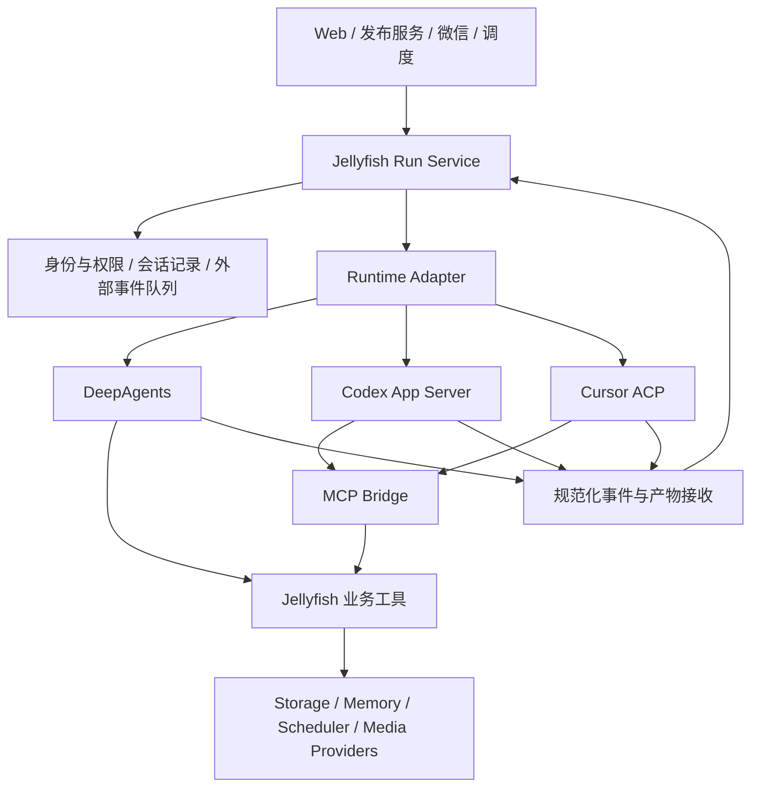

# Jellyfish 可插拔 Agent Runtime：架构评估与改造方案

> 历史设计 / 阶段验收记录：文中的分支、角色与未实现项以记录当时为准。当前 v1.3.0 使用 [标准模式](runtime-standard-mode.md) 和 [主机超管控制台](superadmin-console.md)；早期验证结果不代表当前完整生产验收。

日期：2026-09-15。状态：初始架构评估；单管理员 Codex 试验已另行实现并验证文本调用，见 `codex-runtime-pilot.md`。本文原始阶段顺序由后续决策补充。
代码基线：`94eb1c8` 及当前工作区。已有 scheduler / deployment 改动不属于本提案实施范围。

## 1. 结论

最新设计：超管是部署主机的主人，admin 是其分发账号的独立用户；jellyfishbot 即 OpenJellyfish。默认标准模式由超管连接账号，并可授权可信 admin 共享使用；admin 无权换绑或断开超管连接。可选 Docker 隔离扩展验证通过后，各 admin 自助连接自己的 Codex / Cursor 并独立执行。Docker 打包方式与执行策略分开。以 [可选隔离扩展设计](runtime-deployment-design.md) 为准，本文原始阶段顺序保留作评估背景。

建议推进。替换边界应是完整的 Agent Runtime（执行循环、工具使用、上下文管理和原生能力），而不是 `_resolve_model()` 中的模型供应商。

Jellyfish 保有用户、服务、对话记录、文档、记忆、权限、任务调度和文件资产；DeepAgents、Codex、Cursor 负责具体执行。用户可以选择“引擎 + 原生生图”的组合，也可以单独选择生图供应商。

推荐顺序：先抽出 DeepAgents 适配器，再验证 Codex App Server，随后接 Cursor ACP。第一阶段限定自托管管理员 Web 对话；发布服务、多租户、微信和调度分别验收后开放。

这是可迁移性的技术验证，不代表换引擎后能自动获得相同的指令遵循、技能、记忆、子代理和安全语义。

## 2. 当前代码的实际边界

| 位置 | 已观察到的实现 | 改造影响 |
| --- | --- | --- |
| `app/services/agent.py:383`、`:521` | 管理员 / 批处理工厂，构造 prompt、工具、subagents 和 checkpoint | 分开“准备 Jellyfish 上下文”与“构造 DeepAgents” |
| `app/services/consumer_agent.py:704` | 消费侧工厂，注入文档/脚本白名单、对话目录、记忆工具 | 必须保留服务和消费者权限，不能直接开放管理员目录 |
| `app/routes/chat.py:159` | 解读 LangChain 消息、子图事件、LangGraph interrupt，处理取消和写锁 | 抽出执行服务和事件映射，不让路由识别供应商消息类 |
| `app/routes/consumer.py:125` | SSE 和 OpenAI-compatible 输出直接消费 `astream` | 在规范化事件上保留现有输出协议 |
| `app/services/scheduled_inject.py:304` | `aget_state` / `aupdate_state` 写入合成 AIMessage / ToolMessage | 改为 Jellyfish 外部事件队列；旧注入逻辑仅由 DeepAgents 使用 |
| `app/services/scheduler.py`、`app/channels/wechat/*bridge.py`、`app/routes/batch.py` | 多处直接运行、读取、恢复 graph | 统一调用运行服务，不能只迁移 Web 路由 |
| `app/routes/voice_live.py`、`app/services/inbox.py` | 还有管理员执行入口；语音部分另有直连模型路径 | 纳入入口清单；直连语音模型不随 core 自动替换 |
| `app/services/ai_tools.py:30`、`app/services/providers/registry.py` | 生图已有 capability + model 分发；生成与持久化分离 | 复用现有 provider，无需重写；新增原生产物入口 |
| `app/storage/lock_backend.py:37` | 写锁强制点包装 DeepAgents BackendProtocol | 外部 CLI 的原生 shell / 写文件不会经过此包装 |
| `app/services/conversations.py:190` | Jellyfish 已独立保存 meta 与 messages.jsonl | 保留产品历史，另外记录各 runtime 的会话绑定 |

本轮读取代码和官方文档、检查 CLI 帮助及导出协议 schema；未执行模型调用、账号登录、生图或端到端测试。

## 3. 外部后端的选择依据

### Codex：优先 App Server

官方 App Server 提供双向 JSON-RPC、会话恢复及审批请求；Python 后端可以管理 stdio 子进程。建议使用 stdio，并固定 CLI 版本与生成的协议 schema。动态工具属于实验接口，跨引擎业务工具优先用 MCP。[官方协议](https://learn.chatgpt.com/docs/app-server)

Codex SDK 是另一个接入面，官方 TypeScript 库可在 Node 服务端创建和恢复本地会话。它适合已有 Node 服务的程序调用；当前 Jellyfish 是 Python，直接接 App Server 可减少一层服务。[SDK 文档](https://learn.chatgpt.com/docs/codex-sdk)

本机 `codex-cli 0.154.0-alpha.6.2` 的稳定字段 schema 导出中，有 `imageGeneration` item（含 status/result、可空 savedPath/failure），以及 provider capabilities 中的 imageGeneration 布尔值。这证明此版本存在协议表达，**不证明用户账号已启用、所有 CLI 发行版相同，或无需额外宿主组件即可生成图片**。临时核查文件在 `/tmp/jellyfish-codex-schema-20260915/`，不是项目依赖。

官方生图说明包含原生生图和 API 两种路径；目标部署的实际可用性须单独验证。[生图说明](https://learn.chatgpt.com/docs/image-generation)

### Cursor：优先 CLI 的 ACP 模式

官方已有 `agent acp`，通过 stdio JSON-RPC 提供会话创建/恢复、流式更新、权限决策和取消；也描述了询问、计划、子任务和生图扩展。比单向解析 headless 输出更适合交互式 Jellyfish。[Cursor ACP](https://cursor.com/docs/cli/acp)

`cursor/generate_image` 被文档定义为通知，路径字段可选，不能把收到通知等同于“可下载的图片已经生成”。实施时需固定版本、捕获真实事件并验证文件。当前 PATH 未发现 `agent` 或 `cursor-agent`，没有本机运行验证。

Headless `--print --output-format stream-json` 仅作为批处理兼容方案；不把它假定为完整的双向审批接口。[Headless 文档](https://cursor.com/docs/cli/headless)

## 4. 目标架构



MCP 是引擎调用 Jellyfish 能力的工具接口；Runtime Adapter 是 Jellyfish 驱动引擎的控制接口，两者各有职责。

### 4.1 最小接口（提议，不是现有 API）

```python
class RuntimeAdapter(Protocol):
    async def probe(self, profile) -> RuntimeCapabilities: ...
    async def open_session(self, context, binding=None) -> SessionBinding: ...
    def stream_turn(self, binding, request) -> AsyncIterator[RuntimeEvent]: ...
    async def respond(self, binding, request_id, decision) -> None: ...
    async def cancel(self, binding, run_id) -> None: ...
    async def close_session(self, binding) -> None: ...
```

- `context`：服务端解析的身份、权限、文档、工具、隔离工作区与版本；不得让模型自行声明 user_id / admin_id 来授权。
- `binding`：Jellyfish 对话 ID、runtime 类型/版本、宿主/凭据引用、供应商会话 ID、配置版本。恢复前验证所属身份和权限是否仍有效。
- `request`：本轮消息、附件引用、待投递外部事件和幂等 request_id。附件在运行环境内显式物化，不能把 Jellyfish URL 当作 CLI 可读路径。
- `capabilities`：文本流、图片输入、原生生图、审批、询问、取消、恢复、MCP、子任务可见性等；保留 unknown/unsupported，不能凭 runtime 名字全部标为支持。
- `event` 公共字段：schema_version、conversation_id、run_id、event_id、seq、item_id/parent_id（可空）、type、payload。

规范化事件包含 text_delta、tool_started、tool_completed、approval_requested、input_requested、artifact_created、usage、completed、failed、cancelled。供应商暴露的 reasoning summary 可选展示，不承诺所有引擎都有相同思考流。子任务事件保留父子 ID；供应商原始扩展留在受控字段中，不强行映射成 DeepAgents 子图。

运行状态为 queued → running → waiting_approval / waiting_input → running → completed / failed / cancelled。前端断开不是运行完成；取消后要等引擎确认或终止执行进程，确认资源释放后才解锁。终态与幂等记录由 Jellyfish 保存。

审批保存供应商 request_id 和允许选项。DeepAgents 的 edit 决策不能直接翻译成 Cursor 的 allow-once；仅展示当前后端支持的动作。审批不可恢复时记录失败/失效，禁止把旧批准应用到新操作。

### 4.2 引擎选择和生图选择

建议提供组合预设，同时内部独立配置：

| 组合预设 | runtime | image mode |
| --- | --- | --- |
| Jellyfish 默认 | deepagents | provider（当前配置） |
| Codex 原生 | codex_app_server | runtime_native（探测和实测通过后可选） |
| Cursor 原生 | cursor_acp | runtime_native（探测和实测通过后可选） |
| 自定义组合 | 任一已启用 runtime | provider / runtime_native / disabled |

另有 `image_fallback=none|configured_provider`，默认 none；用户明确选择回退后才使用独立 API，UI 显示实际来源。原生路径通过 runtime 执行生图并接收产物；provider 路径通过 Jellyfish 工具调用 `ai_tools`。不要把原生 agent 生图塞进要求同步返回 bytes 的 ImageProvider，否则会出现嵌套会话和重复调用。

统一产物对象至少包含 artifact_id、owner/scope、run_id、media_type、storage_path、source_runtime/provider、校验和。接收端验证真实文件、大小、类型、路径与符号链接边界，再导入 StorageService；只有存储成功才发布可见产物事件。引擎返回的任意路径或 URL 都不能直接变成对外下载入口。

### 4.3 上下文和会话迁移

- Jellyfish 的文档/记忆是源数据；按引擎生成 instruction/skill 投影，记录版本。文档格式相同不代表指令优先级和行为相同，需做任务集回归。
- 工具中现有业务逻辑先保留；MCP wrapper 调用受控函数，后续再从 LangChain decorator 中逐步解耦。
- 默认新建对话时选择 runtime，已有对话固定绑定。服务配置更新只影响新会话；调度任务记录自己的配置快照。
- 用户主动切换已有对话：等待当前轮结束，创建新的 runtime session，注入来源标记明确的历史摘要、相关文档与产物索引，保存旧绑定。不要复制 LangGraph checkpoint 或重放旧工具调用。
- 外部任务结果先入 Jellyfish 持久队列，再在下一轮作为有来源的上下文投递。DeepAgents 可暂保留原 checkpoint 注入；其他后端不模拟 `aupdate_state`。活跃轮默认排队，支持 steering 的后端以后再开放即时投递。
- 不将记忆检索强绑定某家子代理：提供可复用的记忆工具。自定义子代理配置能否转译为原生子代理是独立能力，不纳入首版等价承诺。

### 4.4 工作区、身份和部署

仅设置 `cwd` 不是读写隔离，现有 Python wrapper 和 LockAwareBackend 也管不到外部 CLI 的原生命令。这是发布服务接入前必须解决的工程问题。

第一阶段：可信管理员、自托管实例、受限工作区、单写者。完整运行周期持有 Jellyfish 工作区独占写租约，其他 Jellyfish 执行入口必须遵守同一租约；它无法约束宿主机上手工运行的其他程序。

发布服务 / 多租户阶段：每个执行隔离环境只挂载允许读取的文档/脚本快照和该会话的可写目录；不挂整个管理员 filesystem。以 OS/容器限制文件、网络、进程与资源。S3 内容先物化，结束后通过 StorageService、路径校验、锁和版本冲突检测提交，保持缓存失效逻辑。

CLI 登录身份、Jellyfish 用户身份和服务访客身份分开管理。runtime profile 持久化凭据引用而非密钥，不复制当前开发者的登录目录给用户。进程仅接收必要环境变量；MCP 凭据限定身份/服务/会话和过期时间。仅换独立目录不能视为多租户安全隔离。

先支持“Jellyfish 与引擎运行在同一台自托管主机”。云端 Jellyfish 驱动用户电脑上的 CLI 还需要本地 worker、配对、认证、断线恢复和产物传输，应单列后续里程碑。CLI 登录可用不等于已验证共享订阅转售或服务计费可行性。

## 5. 文件级落地建议

拟新增（均未实现）：

```text
app/runtime/
  types.py                 # 上下文、绑定、事件、能力、产物
  registry.py              # 注册、profile 解析、探测
  service.py               # 排队、状态、幂等、取消、审批、事件持久化
  adapters/deepagents.py   # 调用现有工厂，收拢 LangGraph 解读
  adapters/codex.py        # App Server 协议和生命周期
  adapters/cursor.py       # ACP 协议和生命周期
  context.py               # 文档、记忆和附件投影
  artifacts.py             # 原生产物校验、归档
  tool_bridge.py           # Jellyfish MCP 工具包装
```

第一步不搬动现有工厂内部代码，DeepAgents adapter 调用原工厂，以遵守当前依赖规则；新路由只依赖 runtime service。后续再拆工厂，避免初始化/循环导入一并扩大。

需要修改的边界：chat/consumer/batch/voice_live 路由、两类微信 bridge、scheduler/inbox、scheduled_inject、conversation/service/task 元数据、preferences/model catalog、启动/关闭生命周期、前端设置与审批/产物展示。旧会话无 runtime 字段时默认 DeepAgents。

runtime 的 model 列表使用自己的探测结果，不能向 Codex/Cursor 透传现有 `anthropic:...` 等 LangChain model_id。现有 LLM BYOK 和 runtime 登录配置也应分开。

## 6. 分阶段验收

| 阶段 | 范围 | 通过条件 |
| --- | --- | --- |
| P0：能力探针 | 固定版本和目标账号，各后端独立实验 | 创建/恢复、流式、一次审批拒绝、取消；原生生图得到真实可归档文件，记录失败和配额形态 |
| P1：DeepAgents 适配 | 提取公共运行边界，现有默认后端 | 管理员/消费者对话、审批编辑、取消、文件锁、回注和旧历史回归；不新增行为漂移 |
| P2：Codex 管理员闭环 | 单用户自托管、原生生图试点 | 同一 Jellyfish 文档任务：读取→修改→生图→归档→第二轮继续；重启恢复、拒绝执行和取消后无孤儿写入 |
| P3：Cursor 管理员闭环 | ACP，同样任务集 | 对等验收；询问/计划请求不挂死；通知与真实产物一致；未知扩展不破坏流 |
| P4：发布服务与后台 | 多租户、调度、微信、S3、远程 worker 分项推进 | 白名单/租户/凭据越权测试；并发锁冲突；任务重复投递不重复执行；断线和配额耗尽有明确状态 |

必须测的故障：进程启动失败、认证失效、缺失终态、审批中断线、取消竞态、生图通知无文件、跨用户路径、S3 提交冲突、原生生图失败后未授权 API 回退、重复请求产生重复副作用。失败不能静默切换到另一引擎重新执行。

不以“能聊天”作为插拔完成标志。实际对比同一组 Jellyfish 任务的成功率、文件正确性、权限遵守、重复副作用、延迟和可观察用量；供应商未提供的 usage/cost 标记 unknown，不填零。

## 7. 决策建议

先投入 P0 + P1/P2 的有限试验，尤其优先验证“原生生图可取回”和“原生文件操作可约束”。通过后再扩到 Cursor 和消费者。当前证据支持做原型；尚不支持承诺三种引擎完全等价、原生生图在所有账号可用，或云端多用户服务已经可交付。
